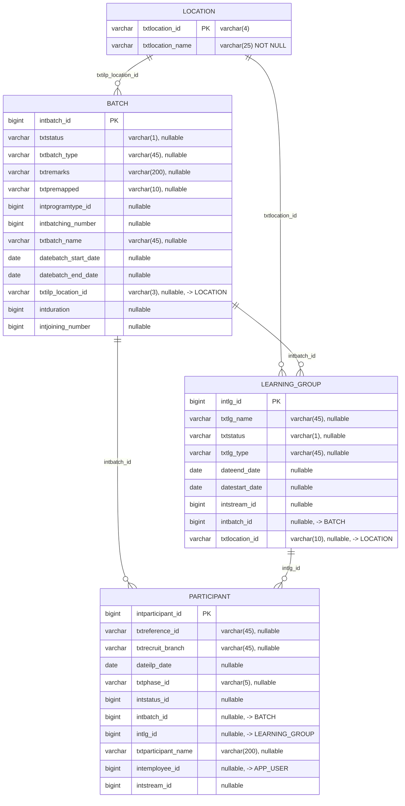
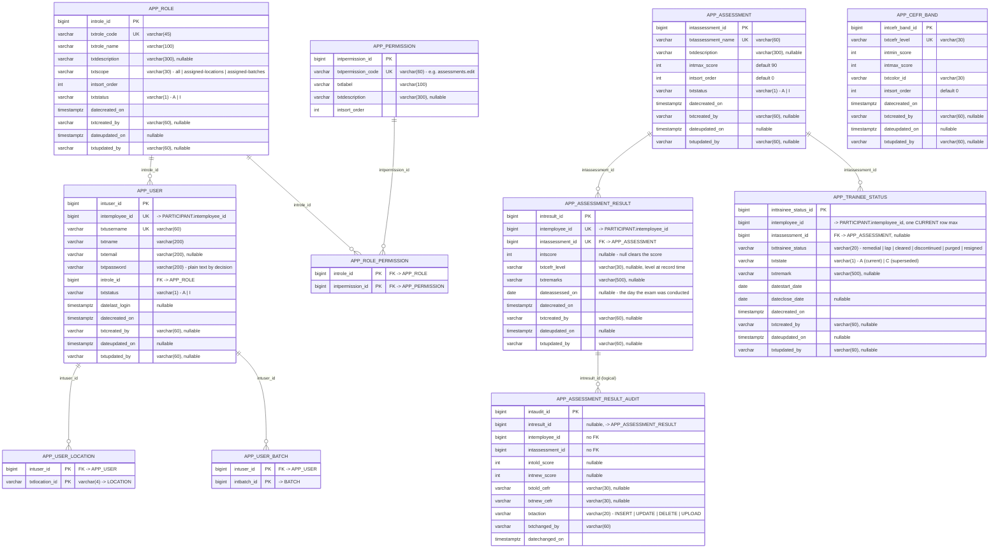
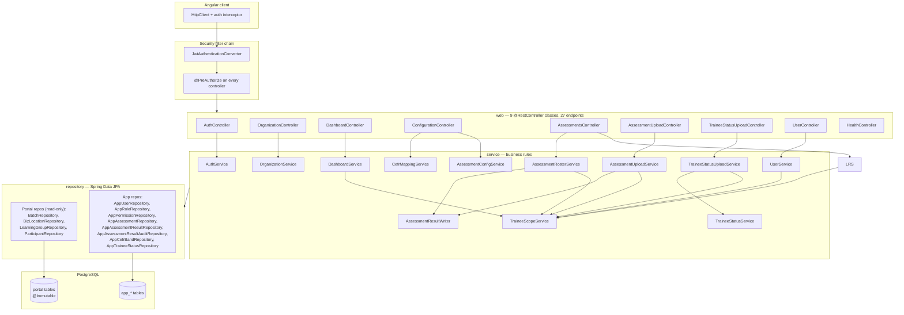
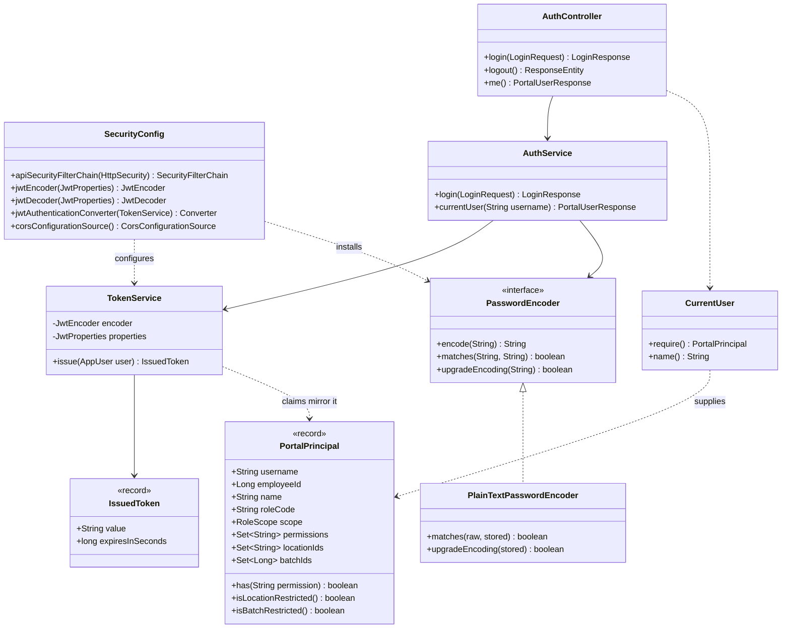
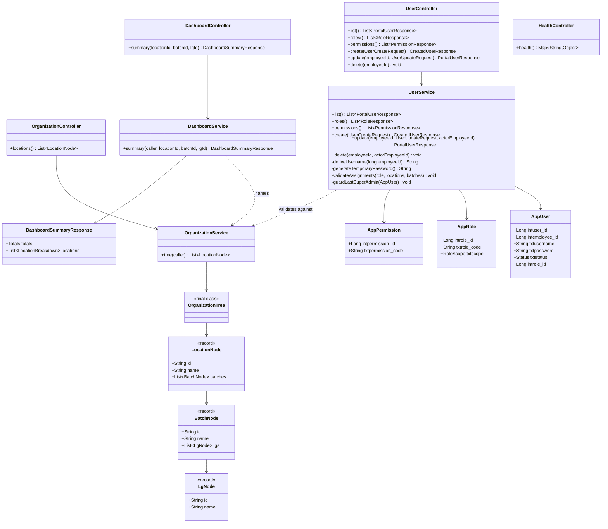
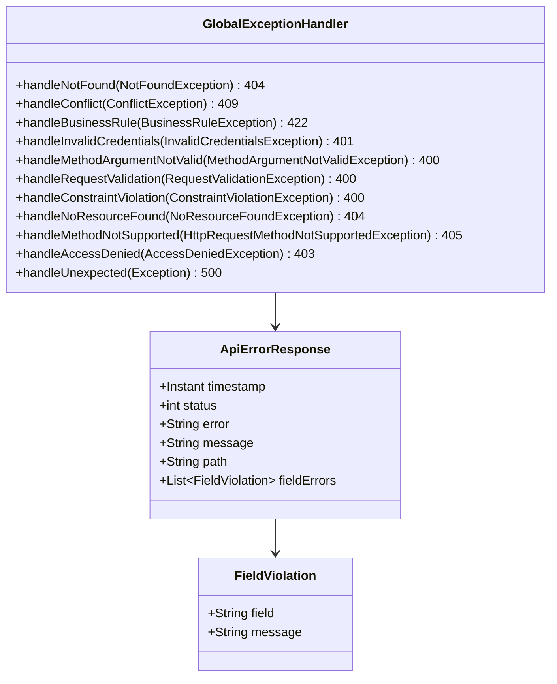

# Database and Class Diagrams

Two sets of diagrams for the implementation as it stands:

1. **[Database](#part-1--database)** — the fifteen tables, what the database enforces,
   and what it deliberately does not.
2. **[Classes](#part-2--classes)** — the Java types, grouped by the job they do.

Every column, key, index and enum value below was read back out of the running
database and the compiled source, not written from memory.

The diagrams are [Mermaid](https://mermaid.js.org/). They render directly on GitHub,
GitLab and in VS Code's Markdown preview; in a plain text editor they show as code
blocks.

Each one is also committed as a rendered SVG in [`docs/diagrams/`](diagrams/) if you
want an image to open in a browser, drop into a slide, or send to someone. **The
Mermaid in this file is the source of truth** — the SVGs are generated from it, so
edit here and regenerate rather than editing an SVG.

| Diagram | SVG |
|---|---|
| 1.2 Portal tables | [`01-portal-tables.svg`](diagrams/01-portal-tables.svg) |
| 1.3 Application tables | [`02-application-tables.svg`](diagrams/02-application-tables.svg) |
| 2.1 Layering | [`03-layering.svg`](diagrams/03-layering.svg) |
| 2.2 Security and authentication | [`04-security-and-auth.svg`](diagrams/04-security-and-auth.svg) |
| 2.3 Assessment domain | [`05-assessment-domain.svg`](diagrams/05-assessment-domain.svg) |
| 2.4 Users, roles and organisation | [`06-users-organisation-dashboard.svg`](diagrams/06-users-organisation-dashboard.svg) |
| 2.6 Error handling | [`07-error-handling.svg`](diagrams/07-error-handling.svg) |

---

## Part 1 — Database

### 1.1 The two halves of the schema

The `public` schema holds two groups of tables with different owners:

| | Portal tables | Application tables |
|---|---|---|
| Tables | `location`, `batch`, `learning_group`, `participant` | 11 × `app_*` |
| Origin | Pre-existing; supplied as Oracle DDL | Created by this project |
| Owner | The wider portal system | This application |
| Migrations | `V1__portal_schema.sql` — `CREATE TABLE IF NOT EXISTS` only | `V2__app_schema.sql` |
| Read/write | **Read-only.** Mapped as `@Immutable` entities | Full CRUD |
| Foreign keys | None | Real, enforced FKs |
| Adopted into Flyway | Yes, via `baseline-on-migrate` | Yes |

The dividing line matters more than it might look. The portal tables are declared
`@Immutable` in JPA, which means Hibernate refuses to issue an `UPDATE` or `DELETE`
against them even by accident — the constraint is enforced by the ORM, not by
convention. The only code that writes to those tables is the development seeder,
which uses `JdbcTemplate` precisely so it cannot create a write path through the
entity model.

### 1.2 Portal tables — pre-existing, read-only

Five relationships, all **logical**: the indexes exist, the foreign keys do not.
This is deliberate — adding a constraint would be a change to a table we were told
not to change, and the production data may already violate it.



Two details worth noticing, because they are easy to trip over:

- **`location.txtlocation_id` is `varchar(4)`, but `batch.txtilp_location_id` is
  `varchar(3)` and `learning_group.txtlocation_id` is `varchar(10)`.** The same
  identifier is typed three different ways. That is inherited from the supplied
  DDL and left exactly as-is; it is why the entity fields are `String` rather than
  a shared value type.
- **`participant.intemployee_id` is the join key to `app_user`**, and it is
  nullable. A participant need not have a portal login.

Indexes present on these tables: `ix_batch_location`,
`ix_learning_group_batch`, `ix_learning_group_location`,
`ix_participant_batch`, `ix_participant_employee`, `ix_participant_lg`.

### 1.3 Application tables — owned by this project

Every FK here is real and enforced. The three carry-through audit columns
(`datecreated_on`, `txtcreated_by`, `dateupdated_on`, `txtupdated_by`) appear on
every `app_*` table except the three pure join tables.



### 1.4 The constraint that carries the most weight

`app_trainee_status` has an unusual index:

```sql
CREATE UNIQUE INDEX uq_app_trainee_status_current_per_employee
    ON app_trainee_status (intemployee_id)
    WHERE txtstate = 'A';
```

A **partial** unique index: it constrains only the rows that are current. So an
employee may accumulate any number of superseded statuses — history is kept — but
can never hold two at once. That single index is what makes "what status does this
person hold?" a question with exactly one answer, and the service layer does not
have to defend the invariant with application checks that could race.
`TraineeStatusService` supersedes the previous row before inserting a new one,
which is what keeps the index satisfied — and a genuine race surfaces as a `409`
rather than as two current rows.

`regular` is deliberately absent from `txttrainee_status`: holding no current row
*is* being regular, so a trainee cannot be "regular" and something else at the same
time, and the dashboard's regular count is the trainee count minus the four
statuses it can count.

The same pattern would have been the right answer for "one current score per
employee per assessment", but that invariant is simpler — unconditional — so it is
a plain unique constraint, `uq_app_result_employee_assessment`.

### 1.5 What is enforced where

The honest summary, since the database does not enforce everything:

| Rule | Enforced by | Enforced in |
|---|---|---|
| One current trainee status per employee | Partial unique index | Database |
| One score per employee per assessment | Unique constraint | Database |
| Role, permission, assessment references | Foreign keys | Database |
| Unique username, employee id, role code, permission code | Unique constraints | Database |
| `intmax_score` between 1 and 1000 | `@Min`/`@Max` | Application |
| `intmin_score <= intmax_score` per CEFR band | Cross-field check | Application |
| A score not exceeding the assessment's maximum | Service check | Application |
| `app_user_location.txtlocation_id` → `location` | **Nothing** | Application (`UserService`) |
| `app_user_batch.intbatch_id` → `batch` | **Nothing** | Application (`UserService`) |
| `app_user.intemployee_id` → `participant` | **Nothing** | Application |
| `app_assessment_result.intemployee_id` → `participant` | **Nothing** | Application (`TraineeScopeService`) |
| `batch.txtilp_location_id` → `location` | **Nothing** | Application |
| Not deleting the last active Super Admin | Service check | Application |

The bottom seven rows are the cost of the read-only rule on the portal tables. A
foreign key from `app_user_location` to `location` would be the natural way to
express that relationship, and adding one would mean altering nothing — it is a
constraint *on the app table* pointing at `location`. I did not add it because the
goal was explicit that the portal tables are not to be touched, and a new FK
requires a lock on the referenced table. So the checks live in `UserService` and
`TraineeScopeService` instead.

**The practical consequence: if you ever write to these tables outside the
application, nothing stops you creating an orphan.** Bulk-loading `app_user_batch`
rows against batch ids that do not exist would succeed silently and produce users
who can sign in but see nothing. The three places to be careful are
`app_user_location`, `app_user_batch`, and any manual insert into
`app_assessment_result`.

### 1.6 Reference data as seeded

**Four roles.**

| Code | Name | Scope | Permissions |
|---|---|---|---|
| `superadmin` | Super Admin | `all` | 8 (everything) |
| `program-manager` | Program Manager | `all` | 6 (no `users.manage`, no `configuration.manage`) |
| `location-admin` | Location Admin | `assigned-locations` | 6 |
| `faculty` | Faculty | `assigned-batches` | 6 |

**Eight permissions**, which are also the JWT authority strings —
`hasAuthority('assessments.edit')` is checking this table's
`txtpermission_code` verbatim:

`dashboard.view`, `assessments.view`, `assessments.edit`,
`trainee-status.view`, `trainee-status.manage`, `reports.view`, `users.manage`,
`configuration.manage`.

**Ten CEFR bands.** Note that 76 appears in two bands — that overlap is in the
published Versant scale and is resolved at runtime by "highest minimum wins", with
the later row breaking a tie.

| Level | Min | Max | Colour |
|---|---|---|---|
| Below A1 | 10 | 22 | `red` |
| A1 | 23 | 30 | `red-orange` |
| A2 | 31 | 36 | `orange` |
| A2+ | 37 | 43 | `amber` |
| B1 | 44 | 51 | `yellow` |
| B1+ | 52 | 59 | `lime` |
| B2 | 60 | 67 | `light-green` |
| B2+ | 68 | 76 | `light-green` |
| C1 | **76** | 85 | `green` |
| C2 | 86 | 90 | `green-dark` |

---

## Part 2 — Classes

86 source files under `com.bizzskill.portal`. Rather than one unreadable diagram,
here is the layering and then one diagram per concern.

### 2.1 Layering

Requests enter at a controller, which delegates to a service, which reads and
writes through repositories. Controllers hold no business logic and entities never
leave the service layer — responses are DTOs. That is what keeps
`app_user.txtpassword` from being serialised into a response by accident.



### 2.2 Security and authentication

The token carries identity, role, permission codes and the caller's allowed
locations and batches, so authorisation needs no database round trip per request.
The trade-off is that a change to someone's access takes effect at their next
sign-in, not immediately — documented in `backend/README.md`.



`PasswordEncoderConfig` decides which `PasswordEncoder` the application gets,
reading `portal.security.password-encoding`. It currently defaults to `plain`, and
logs a warning at startup saying so. Setting that property to `bcrypt` returns a
`BCryptPasswordEncoder` instead — **a configuration change, not a code change**,
because nothing else in the codebase knows how passwords are stored. That is the
whole point of routing every comparison through the interface.

`upgradeEncoding` is the hook that makes that swap a migration rather than a
flag day: it currently answers `true` for every value, so a future BCrypt
implementation can use it to spot a stored password that still needs hashing and
re-hash it on the owner's next successful sign-in. The plain-text implementation
takes care to compare in a way that does not short-circuit on the first differing
character, so the time it takes to reject a wrong password does not leak how much
of it was right.

### 2.3 Assessment domain

The core workflow. `AssessmentResultWriter` exists because two callers —
`AssessmentRosterService` (one trainee at a time) and `AssessmentUploadService` (a
whole CSV) — must write scores *identically*, including the audit trail. Duplicating
that logic is how two paths drift apart.

`TraineeStatusUploadService` is the status equivalent: it validates a whole sheet and
then calls `TraineeStatusService.save` once per row, so the bulk sheet and the single
`Change status` action cannot diverge in what they allow or in what they record.

```mermaid
classDiagram
    direction TB

    class AssessmentsController {
        +trainees(locationId, batchId, lgId) List~TraineeAssessmentResponse~
        +saveResults(employeeId, TraineeResultsRequest) void
        +saveTraineeStatus(employeeId, TraineeStatusRequest) void
    }
    class AssessmentUploadController {
        +template(examId, locationId, batchId, lgId) ResponseEntity~String~
        +commit(UploadCommitRequest) UploadCommitResponse
    }
    class ConfigurationController {
        +assessments() List~AssessmentResponse~
        +activeAssessments() List~AssessmentResponse~
        +createAssessment(AssessmentRequest) AssessmentResponse
        +updateAssessment(id, AssessmentRequest) AssessmentResponse
        +deleteAssessment(id) void
        +cefrMapping() List~CefrBandResponse~
        +replaceCefrMapping(List~CefrBandRequest~) List~CefrBandResponse~
    }

    class TraineeScopeService {
        +find(caller, locationId, batchId, lgId) List~Participant~
        +requireVisible(caller, employeeId) Participant
        +allowedBatchIds(caller) Set~Long~
    }
    class AssessmentRosterService {
        +roster(caller, locationId, batchId, lgId) List~TraineeAssessmentResponse~
        +saveResults(caller, employeeId, Map) void
    }
    class AssessmentResultWriter {
        +write(employeeId, assessmentId, score, bands, actor) void
    }
    class AssessmentUploadService {
        +templateCsv(caller, examId, locationId, batchId, lgId) String
        +commit(caller, UploadCommitRequest) UploadCommitResponse
    }
    class TraineeStatusService {
        +save(caller, employeeId, TraineeStatusRequest) void
    }
    class TraineeStatusUploadService {
        +templateCsv(caller, locationId, batchId, lgId, StatusFilter, List~String~ examIds) byte[]
        +lookup(caller, locationId, batchId, lgId, List~Long~ employeeIds) TraineeStatusLookupResponse
        +commit(caller, TraineeStatusUploadRequest) TraineeStatusUploadResponse
    }
    class AssessmentConfigService {
        +list() List~AssessmentResponse~
        +active() List~AssessmentResponse~
        +create(AssessmentRequest) AssessmentResponse
        +update(id, AssessmentRequest) AssessmentResponse
        +delete(id) void
        -refuseLoweringBelowRecordedScores(AppAssessment, int) void
    }
    class CefrMappingService {
        +mapping() List~CefrBandResponse~
        +orderedBands() List~AppCefrBand~
        +levelFor(int score) String
        +levelFor(int score, List~AppCefrBand~) String$
        +replace(List~CefrBandRequest~) List~CefrBandResponse~
    }

    class AppAssessment {
        +Long intassessment_id
        +String txtassessment_name
        +int intmax_score
        +int intsort_order
        +Status txtstatus
    }
    class AppAssessmentResult {
        +Long intresult_id
        +Long intemployee_id
        +Long intassessment_id
        +Integer intscore
        +String txtcefr_level
    }
    class AppAssessmentResultAudit {
        +Long intaudit_id
        +Integer intold_score
        +Integer intnew_score
        +AuditAction txtaction
    }
    class AppCefrBand {
        +Long intcefr_band_id
        +String txtcefr_level
        +int intmin_score
        +int intmax_score
    }
    class AppTraineeStatus {
        +Long inttrainee_status_id
        +Long intemployee_id
        +TraineeStatus txttrainee_status
        +StatusState txtstate
        +LocalDate datestart_date
        +LocalDate dateclose_date
    }

    AssessmentsController --> AssessmentRosterService
    AssessmentsController --> TraineeStatusService
    AssessmentUploadController --> AssessmentUploadService
    ConfigurationController --> AssessmentConfigService
    ConfigurationController --> CefrMappingService

    AssessmentRosterService --> AssessmentResultWriter
    AssessmentUploadService --> AssessmentResultWriter
    AssessmentRosterService --> TraineeScopeService
    AssessmentUploadService --> TraineeScopeService
    TraineeStatusService --> TraineeScopeService
    TraineeStatusUploadService --> TraineeStatusService

    AssessmentResultWriter --> AppAssessmentResult
    AssessmentResultWriter --> AppAssessmentResultAudit
    AssessmentRosterService --> AppAssessment
    AssessmentConfigService --> AppAssessment
    CefrMappingService --> AppCefrBand
    TraineeStatusService --> AppTraineeStatus
```



### 2.4 Users, roles and organisation

`UserService` is the only place that writes to `app_user`,
`app_user_location` and `app_user_batch`, and the only place that enforces the
assignment rules the database does not.



### 2.5 Identity is a string of digits

One cross-cutting detail that shapes both diagrams: on the wire, an employee id is
a **string** (`"41201"`), while in the database it is a `bigint`. The DTOs use
`String` because a 64-bit identifier exceeds the safe integer range in JavaScript,
and silently rounding a student's id would be a data-corruption bug rather than a
display glitch. Conversion happens once, at the service boundary.

Likewise, every id in `OrganizationTree` is a string for the same reason, and the
frontend's filter state holds ids as strings throughout.

### 2.6 Shared error handling

Every failure leaves the API in one shape, so the client has one thing to parse.
One class produces all of it: `GlobalExceptionHandler`, which is a
`@RestControllerAdvice` rather than a controller — it contributes no endpoints of
its own, only the advice that wraps every other controller's exceptions.

```json
{
  "timestamp": "2026-09-13T10:33:14.404666Z",
  "status": 401,
  "error": "Unauthorized",
  "message": "Your Employee ID or password is incorrect.",
  "path": "/api/auth/login",
  "fieldErrors": [{ "field": "rows[3].score", "message": "..." }]
}
```



Two of those handlers exist because testing found the gaps: without an explicit
`NoResourceFoundException` handler a mistyped URL fell through to the catch-all and
returned **500** instead of 404, and a wrong HTTP method likewise answered 500
rather than 405. The catch-all deliberately discards the original message and logs
it instead, so an internal failure never leaks a stack trace or a SQL fragment to
the client.

---

## Regenerating these

The schema sections came from the live database, so they can be refreshed at any
time:

```bash
export PATH=/Library/PostgreSQL/18/bin:$PATH

# Columns
PGPASSWORD=123 psql -h localhost -U postgres -d bizzskill_portal -c "
  select table_name, column_name, data_type, is_nullable
  from information_schema.columns
  where table_schema='public' order by table_name, ordinal_position;"

# Keys
PGPASSWORD=123 psql -h localhost -U postgres -d bizzskill_portal -c "
  select table_name, constraint_type, constraint_name
  from information_schema.table_constraints
  where table_schema='public' order by table_name;"

# Indexes
PGPASSWORD=123 psql -h localhost -U postgres -d bizzskill_portal -c "
  select tablename, indexname, indexdef from pg_indexes
  where schemaname='public' order by tablename, indexname;"
```

If a column here ever disagrees with `information_schema`, the database is right
and this document is stale — Hibernate runs with `ddl-auto: validate`, so the
application will refuse to start rather than work against a mismatched schema.

To re-render the SVGs after editing a diagram (uses your installed Chrome):

```bash
cd docs
npx -y @mermaid-js/mermaid-cli@11 -i database-and-class-diagrams.md -o /tmp/out.md
```

Or render a single diagram pulled out into its own `.mmd` file:

```bash
npx -y @mermaid-js/mermaid-cli@11 -i diagram.mmd -o diagram.svg -b white
```
